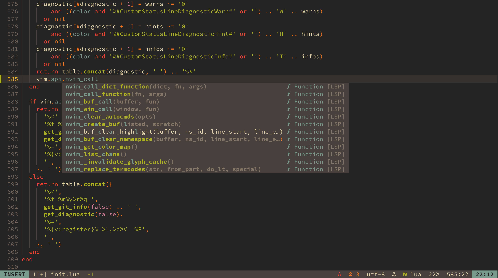

## A [Colemak](https://colemak.com/) User's [Neovim](https://neovim.io/) Config
> A **clean**, **single-file** configuration for **[Neovim](https://neovim.io/)** with key bindings for the **[Colemak](https://colemak.com/)** keyboard layout.

> **Note:** This README.md only considers UNIX-like systems.



### Table of Contents
- [Dependencies](#dependencies)
- [Installation](#installation)
- [Todos](#todos)

### Dependencies
- [Neovim](https://neovim.io/) ≥ 0.11.0 or Nightly version
- For [nvim-treesitter](https://github.com/nvim-treesitter/nvim-treesitter/tree/main/)
  - [`tree-sitter-cli`](https://github.com/tree-sitter/tree-sitter/blob/master/crates/cli/README.md/)
  - a C compiler such as [`gcc`](https://gcc.gnu.org/), msvk
  - [`curl`](https://curl.se/)
  - [`tar`](https://www.gnu.org/software/tar/)
- For [LuaSnip](https://github.com/L3MON4D3/LuaSnip/)
  - [`make`](https://www.gnu.org/software/make/)
- Optional:
  - [`ripgrep`](https://github.com/BurntSushi/ripgrep/)
  - [`fd`](https://github.com/sharkdp/fd/)
  - [Nerd Font](https://www.nerdfonts.com/) if you want to show some icons
  - Configured Language Servers:
    - [clangd](https://github.com/clangd/clangd/)
    - [typescript-language-server](https://github.com/typescript-language-server/typescript-language-server/)
    - [basedpyright](https://github.com/DetachHead/basedpyright/)
    - [lua-language-server](https://github.com/LuaLS/lua-language-server/)
    - [gopls](https://go.dev/gopls/)
    - [bash-language-server](https://github.com/bash-lsp/bash-language-server/)
    - [fish-lsp](https://github.com/ndonfris/fish-lsp/)
    - [vscode-langservers-extracted](https://github.com/hrsh7th/vscode-langservers-extracted/)
    - [vim-language-server](https://github.com/iamcco/vim-language-server/)
  - Debuggers
    - [delve](https://github.com/go-delve/delve/) for Go
  - Formatters
    - [black](https://github.com/psf/black/)
    - [stylua](https://github.com/JohnnyMorganz/StyLua/)
    - [shfmt](https://github.com/patrickvane/shfmt/)

### Installation
First, clone this repo:
```bash
git clone https://github.com/gczcn/dotfile
```
Then, use [`stow`](https://www.gnu.org/software/stow/) to create a symbolic link pointing to the Neovim config:
```bash
cd dotfile
stow nvim
```
Last, open Neovim:
```bash
nvim
```
All done.

### Todos
- [ ] Remove more useless plugins.
- [ ] The main branch of nvim-treesitter and nvim-treesitter-textobjects.
